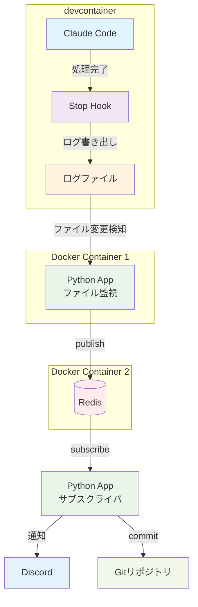

# Simple Notification Bridge

## 概要

ファイルを監視して新しい書き込みを検知したらRedisへpublishするだけのシンプルなアプリケーションです。
主なユースケースは devcontainer 内で実行したClaude Codeの処理が完了したときに通知やコミットなどの後続処理を行うことです。

## アーキテクチャ

システム構成。



## 使い方

devcontainer で Claude Code を動かす場合を想定しています。

Claude Code の [Stop hook](https://docs.anthropic.com/en/docs/claude-code/hooks#stop) を使用して `~/.claude/events.log` にログを書き込みます。

Stop hook の設定例：

```bash
jq -r '"\(.)"' >> ~/.claude/events.log
```

Redisを起動します。

```bash
docker run -d --name redis -p 16379:6379 redis
```

Simple Notification Bridge は `claude-code-config` をマウントして `events.log` を監視します：

```bash
docker run -d --name snb --network container:redis -v claude-code-config:/.claude:ro ghcr.io/backpaper0/simple-notification-bridge:v3
```

Claude Code のタスクが完了すると Stop hook が実行され、Redisへメッセージがpublishされます。

メッセージをsubscribeして通知やコミットを行いたい場合は`post_process.py`を動かしてください。

```bash
uv run post_process.py
```
