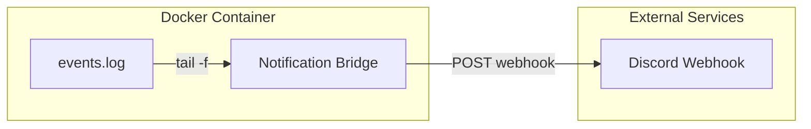

# Simple Notification Bridge

## 概要

ログファイルを監視して Discord に通知を送るシンプルなアプリケーションです。
主なユースケースは devcontainer 内で実行したタスクが完了したときに Discord に通知することです。

## アーキテクチャ

システム構成。



## アプリケーション

### 技術スタック

- Python
- requests
- pydantic-settings

### 機能

- ログファイル（events.log）をリアルタイムで監視
- 新しい行が追加されると Discord Webhook に POST リクエストを送信
- 設定は環境変数で管理

### 設定

`.env`ファイルで設定を行います：

```env
DISCORD_WEBHOOK_URL=https://discord.com/api/webhooks/your-webhook-url
EVENT_LOG=events.log
```

## 使い方

### Docker を使用

```bash
# イメージをビルド
docker build -t simple-notification-bridge .

# コンテナを起動
docker run -d --name snb --env-file .env -v ./events.log:/app/events.log simple-notification-bridge
```

### 直接実行

```bash
# 依存関係をインストール
uv sync

# アプリケーションを実行
python main.py
```

### devcontainer で Claude Code を動かす場合

Claude Code の [Stop hook](https://docs.anthropic.com/en/docs/claude-code/hooks#stop) を使用して `~/.claude/events.log` にログを書き込みます。

Stop hook の設定例：

```bash
jq -r '"\(.)"' >> ~/.claude/events.log
```

Simple Notification Bridge は `claude-code-config` をマウントして `events.log` を監視します：

```bash
docker run -d --name snb -v claude-code-config:/.claude:ro --env-file .env ghcr.io/backpaper0/simple-notification-bridge:latest
```

`.env` ファイルで Webhook の URL とログファイルのパスを設定します：

```env
DISCORD_WEBHOOK_URL=https://discord.com/api/webhooks/your-webhook-url
EVENT_LOG=/.claude/events.log
```

Claude Code のタスクが完了すると Stop hook が実行され、Discord に通知が送信されます。
