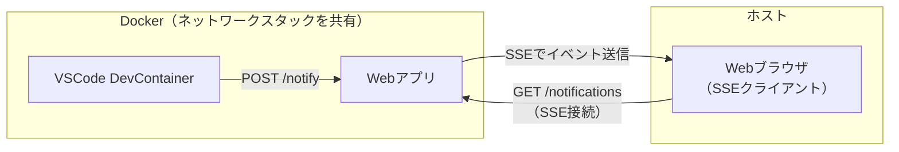
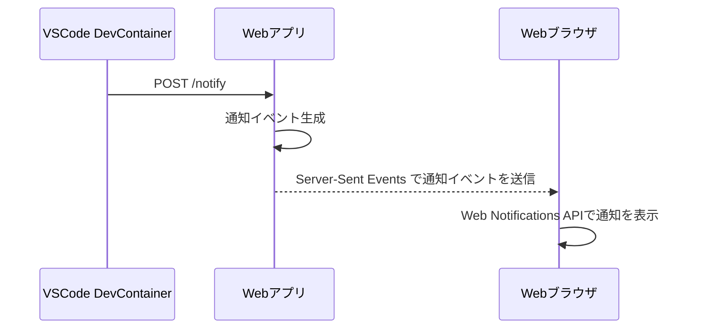

# Simple Notification Bridge

## 概要

VSCode の devcontainer からホスト側へ通知を行うための仕組みを提供する Web アプリケーションです。
主なユースケースは devcontainer 内で実行したタスクが完了したときに通知することです。

## アーキテクチャ

システム構成。



通知の処理シーケンス。



## Web アプリ

### 技術スタック

- Python
- FastAPI
- pydantic-settings

### エンドポイント

- `GET /index.html`
  - 画面を開くと Web Notifications API の権限設定を行い、`GET /notifications`を使用して Server-Sent Events の接続を確立する
  - Server-Sent Events を通じて通知イベントを受け取ると Web Notifications API を用いて通知を行う
- `POST /notify`
  - 接続済みの Server-Sent Events セッションに対して通知イベントを送信する
- `GET /notifications`
  - Server-Sent Events の接続を確立する

### 設定

- 設定は`.env`ファイルで行う
- 設定する値は次の通り
  - 通知のタイトル

## コンテナイメージのビルド

以下のコマンドでコンテナイメージをビルドします。

```bash
docker build -t simple-notification-bridge .
```

## devcontainer で Claude Code を動かす場合の使い方

`.devcontainer/devcontainer.json`へポート公開の設定を追加します。

```json
{
  "runArgs": [
    "--publish=8000:8000"
  ]
}
```

devcontainerのコンテナーIDを調べて、ネットワークスタックを共有させてWebアプリを起動します。

```bash
docker run -d --network container:65cab0ec78dd simple-notification-bridge
```

http://localhost:8000 をWebブラウザで開きます。

次のようなコマンドでClaude Codeを実行します。

```bash
claude -p "◯◯を実装してください。作業が完了したら curl localhost:8000 -XPOST を実行してください。"
```
